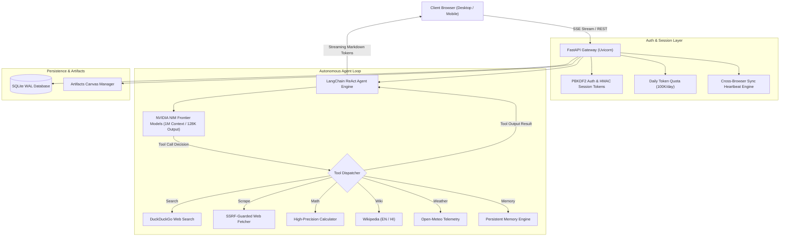

# 🧠 Cortex Agent — Autonomous Multi-Model Intelligence Studio

<div align="center">

[](https://github.com/23f2003236/cortex-agent)
[](https://www.python.org/)
[](https://fastapi.tiangolo.com/)
[](https://www.langchain.com/)
[](https://build.nvidia.com)
[](https://github.com/23f2003236/cortex-agent)
[](https://github.com/23f2003236/cortex-agent)
[](LICENSE)

<br/>

**A production-grade, enterprise autonomous intelligence platform engineered for agentic coding, deep research, real-time tool orchestration, and deliverable synthesis.**  
*Powered by FastAPI, LangChain, NVIDIA NIM Frontier Models, SQLite WAL, and a modern Claude Code / Linear-inspired Obsidian UI.*

</div>

---

> [!IMPORTANT]
> 🚧 **NOTE: WE ARE STILL ACTIVELY WORKING ON THIS PROJECT!**  
> Cortex Agent is currently under continuous active engineering and refinement. Architectural upgrades, new autonomous toolkits, multi-agent coordination protocols, and model integrations are being actively pushed. Star ⭐ the repository and watch releases to stay updated!

---

## 📑 Table of Contents

- [Overview](#-overview)
- [Frontier Model Fleet (1M Context & 128K Output)](#-frontier-model-fleet)
- [Key Features & Architecture](#-key-features--architecture)
- [Autonomous Tool Arsenal (ReAct Loop)](#-autonomous-tool-arsenal-react-loop)
- [Full Tech Stack & Libraries](#-full-tech-stack--libraries)
- [System Architecture Flow](#-system-architecture-flow)
- [Quickstart Installation](#-quickstart-installation)
- [Environment Configuration](#-environment-configuration)
- [Security, Privacy & Secrets Policy](#-security-privacy--secrets-policy)
- [Project Directory Layout](#-project-directory-layout)
- [License & Intellectual Property](#-license--intellectual-property)

---

## 🌟 Overview

**Cortex Agent** bridges the gap between raw LLM APIs and an end-to-end, multi-user autonomous research and coding environment. It integrates:
- **Claude Code-grade reasoning depth** with up to **1,000,000 token context windows** and **128,000 token maximum output ceilings**.
- **Autonomous agentic execution** via a ReAct tool-calling loop that searches the live web, scrapes complex articles, executes mathematical computations, inspects global weather telemetry, and preserves long-term user memories.
- **Claude-style Artifacts & Canvas Studio** for live interactive previews of code, Markdown PRDs, architecture specifications, and SVG diagrams.
- **Multi-Browser & Multi-Tab Real-Time Sync** that keeps your sessions, conversation history, and active turns instantaneously synchronized across multiple browser windows and devices without collisions or state desynchronization.

---

## 🚀 Frontier Model Fleet

Cortex Agent features a dynamically selectable model registry equipped with model-specific architectural ceilings and token budgeting:

| Model ID | Public Name | Context Window | Max Output | Primary Specialization |
|---|---|---|---|---|
| `nvidia/nemotron-3-super-120b-a12b` | **Cortex 5 Super** | **1,000,000** (1M) | **65,536** (64K) | 120B Flagship MoE Super Agent for deep coding & multi-file architectures |
| `nvidia/nemotron-3-ultra-550b-a55b` | **Cortex 5 Ultra** | **1,000,000** (1M) | **65,536** (64K) | 550B Frontier model for complex synthesis & enterprise PRDs |
| `openai/gpt-oss-20b` | **Cortex 4 Flagship** | **131,072** (128K) | **131,072** (128K) | Deep Chain-of-Thought reasoning, logic proofs & algorithmic problem solving |
| `z-ai/glm-5.3` | **Cortex GLM 5.3** | **1,000,000** (1M) | **128,000** (128K) | Ultra-long document analysis, mathematical proofs & comprehensive reporting |
| `z-ai/glm-5.3-flash` | **Cortex GLM 5.3 Flash** | **1,000,000** (1M) | **128,000** (128K) | High-throughput long-context streaming & rapid document parsing |
| `nvidia/nemotron-3.5-lightning-30b-a3b` | **Cortex 3.5 Lightning** | **262,144** (262K) | **32,768** (32K) | Sub-second TTFT lightning responses for rapid prototyping & instant Q&A |
| `nvidia/nemotron-3-nano-omni-30b-a3b-reasoning` | **Cortex 4 Omni** | **262,144** (262K) | **32,768** (32K) | Multimodal visual comprehension, screenshot analysis & UI review |

---

## ⚡ Key Features & Architecture

### 1. Claude-Grade Depth & Anti-Brevity Engine
- **No Shallow Answers**: Cortex enforces comprehensive multi-chapter masterclass structures. It never outputs a bare table or an abbreviated snippet without complete conceptual context and production-ready code.
- **Dynamic Reasoning Headroom**: Allocates dedicated `+8,192 token` headroom for reasoning models (`gpt-oss`, `glm-5.3`, `nano-omni`) so internal thinking traces never starve user-facing Markdown output.
- **Auto-Healing Syntax Fences**: Live streaming parser automatically heals unclosed code blocks and Markdown syntax if generation hits token boundaries.

### 2. Multi-Browser & Multi-Tab Real-Time Sync
- **State Synchronization Heartbeat**: Centralized SSE & polling synchronization endpoint (`/api/sync/heartbeat` and `/api/sync/state`) tracks active conversation changes and unread message counters across all open tabs.
- **Conflict-Free State**: Opening a conversation on one device immediately reflects active state across all connected browser tabs.
- **Turn-Order Integrity**: Cryptographically guarded conversation turn sequencing prevents out-of-order message placement.

### 3. Claude-Style Artifacts & Canvas Studio
- **Centralized Artifact Repository**: Automatically harvests all generated code modules, technical documentation, architectural diagrams, and data analyses into an interactive sidebar gallery.
- **Side-by-Side Split View**: Read explanations on the left while editing, inspecting, copying, or downloading code files on the right.
- **KaTeX Mathematical & Chemical Normalization**: Full native support for LaTeX display math (`$$...$$`), inline equations (`$...$`), and complex chemical reactions via KaTeX `\ce{...}` syntax.

### 4. Interactive Terminal Simulator & Guest Test Drive
- **Landing Page Terminal**: Interactive browser-based terminal simulator showcasing real Cortex CLI commands and agent capabilities before logging in.
- **1-Click Frictionless Guest Mode**: Instantly test drive all features with a single click, protected by an automatic daily token quota.

---

## 🛠️ Autonomous Tool Arsenal (ReAct Loop)

Cortex Agent features an autonomous ReAct loop that executes external tools in real time:

- 🔍 **`web_search`**: Live real-time internet search via DuckDuckGo with exponential backoff and query sanitization.
- 🌐 **`fetch_webpage`**: Deep full-text article extraction with an integrated SSRF (Server-Side Request Forgery) guard against private IP ranges.
- 🧮 **`calculator`**: High-precision mathematical and scientific computation engine.
- 📚 **`wikipedia_lookup`**: Encyclopedic knowledge retrieval supporting multilingual queries (English and Hindi).
- ⛅ **`weather_lookup`**: Live meteorological telemetry and global weather forecasts via Open-Meteo API.
- ⏰ **`current_datetime`**: Accurate timezone-aware date and time synchronization.
- 🧠 **`remember`**: Persistent cross-session user memory and project preferences storage.

---

## 💻 Full Tech Stack & Libraries

### Backend
- **[FastAPI](https://fastapi.tiangolo.com/)** (`>=0.116`): High-performance asynchronous API framework handling SSE streams, authentication, and tool execution.
- **[LangChain Core & LangChain OpenAI](https://www.langchain.com/)** (`>=0.3`): Agentic ReAct orchestration, tool-binding schemas, and model abstractions.
- **[Uvicorn](https://www.uvicorn.org/)** (`>=0.35`): Production-grade ASGI server with asynchronous event loops.
- **[Python-Dotenv](https://github.com/theskumar/python-dotenv)** (`>=1.1`): Secure environment variable management.
- **[SQLite3 (WAL Mode)](https://www.sqlite.org/)**: Zero-dependency, crash-resilient transactional storage with Write-Ahead Logging and mutex locking.
- **Cryptographic Security**: PBKDF2-HMAC-SHA256 password hashing with unique per-user salts; HMAC-SHA256 signed session tokens.

### Document Ingestion & Multimodal Processing
- **[PyPDF](https://pypi.org/project/pypdf/)** (`>=5.0`): Enterprise PDF text and document extraction.
- **[Python-Docx](https://python-docx.readthedocs.io/)** (`>=1.1`): Microsoft Word (.docx) document ingestion.
- **[OpenPyXL](https://openpyxl.readthedocs.io/)** (`>=3.1`): Microsoft Excel (.xlsx) spreadsheet parsing.
- **[Pillow (PIL)](https://pillow.readthedocs.io/)** (`>=10.0`): High-performance image processing, dimensions extraction, and base64 compression.
- **[DuckDuckGo-Search](https://github.com/deedy5/duckduckgo_search)** (`>=6.0`): Unauthenticated web search gateway.

### Frontend Client
- **Obsidian Dark Design System**: Handcrafted glassmorphic interface inspired by Linear and Claude Code.
- **Zero-Bundler Architecture**: Pure vanilla JavaScript (ES6+), pure CSS variables, zero npm/node_modules build step required.
- **[Marked.js](https://marked.js.org/)**: Markdown rendering with streaming token support.
- **[Prism.js](https://prismjs.com/)**: Syntax highlighting across 50+ programming languages.
- **[KaTeX](https://katex.org/)**: Fast math formula typesetting and chemical notation.
- **[DOMPurify](https://github.com/cure53/DOMPurify)**: Client-side XSS protection and HTML sanitization.

---

## 🏛️ System Architecture Flow



---

## 🛠️ Quickstart Installation

### 1. Prerequisites
- **Python 3.10, 3.11, or 3.12** installed on your system.
- An **NVIDIA NIM API Key** (Free tier available at [build.nvidia.com](https://build.nvidia.com)).

### 2. Clone the Repository
```bash
git clone https://github.com/23f2003236/cortex-agent.git
cd cortex-agent
```

### 3. Setup Virtual Environment

**On Windows (PowerShell):**
```powershell
python -m venv .venv
.\.venv\Scripts\Activate.ps1
```

**On macOS / Linux:**
```bash
python3 -m venv .venv
source .venv/bin/activate
```

### 4. Install Dependencies
```bash
pip install -r requirements.txt
```

### 5. Setup Environment Variables
Copy the template file to `.env`:

**Windows (PowerShell):**
```powershell
Copy-Item .env.example .env
```

**macOS / Linux:**
```bash
cp .env.example .env
```

Open `.env` in your editor and enter your credentials:
```env
# Paste your NVIDIA API key from build.nvidia.com
NVIDIA_API_KEY=nvapi-your-actual-api-key-here

# Default Model Selection
MODEL_NAME=nvidia/nemotron-3-super-120b-a12b
NVIDIA_BASE_URL=https://integrate.api.nvidia.com/v1
MAX_OUTPUT_TOKENS=65536

# Secret key for JWT session tokens (generate a random 64-char string)
SECRET_KEY=change-this-to-a-secure-random-secret-key-in-production
```

### 6. Launch Cortex Agent
```bash
uvicorn main:app --reload --host 127.0.0.1 --port 8000
```

Open your browser and navigate to:
👉 **`http://127.0.0.1:8000`**

---

## 🔒 Security, Privacy & Secrets Policy

We take security and credentials privacy extremely seriously:
- **Zero Secrets in Git**: The repository `.gitignore` strictly ignores `.env`, all `*.db`, session keys, backups, and runtime logs.
- **Automated Secret Scrubbing**: All streaming tokens and agent outputs pass through regex sanitizers that redact accidental leakage of API keys (`nvapi-...`, `sk-...`, etc.).
- **Safe Web Fetching**: The `fetch_webpage` tool contains built-in SSRF protections blocking calls to `localhost`, `127.0.0.1`, loopback, and private IPv4/IPv6 address blocks.
- **Salted Password Hashing**: Passwords are never stored in plaintext. They are protected by PBKDF2 with HMAC-SHA256 and unique per-user 16-byte random cryptographic salts.

---

## 📂 Project Directory Layout

```text
cortex-agent/
├── main.py                      # FastAPI server, tool loop, SSE streaming & auth routes
├── database.py                  # SQLite WAL storage, user auth, usage quotas & artifacts
├── requirements.txt             # Production Python dependencies
├── .env.example                 # Sanitized environment configuration template
├── .gitignore                   # Bulletproof exclusion rules for secrets, DBs & caches
├── LICENSE                      # Source-Available Strict Attribution & Anti-Plagiarism License
├── README.md                    # Comprehensive documentation & architecture guide
├── static/                      # Silicon Valley Obsidian Frontend
│   ├── index.html               # Main application client, auth modal & terminal simulator
│   ├── style.css                # Obsidian design system, glassmorphism & typography
│   └── app.js                   # Reactive frontend engine, split canvas & sync client
└── tests/                       # Comprehensive automated test suite
    ├── test_production_readiness.py  # Auth, quotas, security, models & tools unit tests
    └── test_multi_browser_sync.py    # Multi-tab real-time state synchronization tests
```

---

## 📄 License & Intellectual Property

```text
SOURCE-AVAILABLE STRICT ATTRIBUTION & PROPRIETARY LICENSE
Copyright (c) 2026 Rohan. All Rights Reserved.
```

Cortex Agent is the original creation and intellectual property of **Rohan**.

### Attribution & Anti-Plagiarism Notice:
- **Sole Authorship**: You may NOT claim authorship, inventorship, creation, or ownership of Cortex Agent, its codebase, prompts, design systems, or algorithms.
- **Mandatory Attribution**: Any permitted public fork, demonstration, academic study, or technical showcase MUST prominently credit:
  > **"Original Creator: Rohan (Cortex Agent)"** with a direct link to this repository.
- **Commercial Restriction**: Unauthorized commercial redistribution, resale, or hosting as a commercial SaaS is strictly prohibited without prior written permission from Rohan.
- **Personal & Educational Use**: You are welcome to clone, study, test locally, and contribute improvements via Pull Requests!

See the full [LICENSE](LICENSE) file for complete legal terms.

---

<div align="center">
  <b>Built with ❤️ and continuous innovation by Rohan.</b><br/>
  <i>Star ⭐ this repository if you find Cortex Agent useful!</i>
</div>
